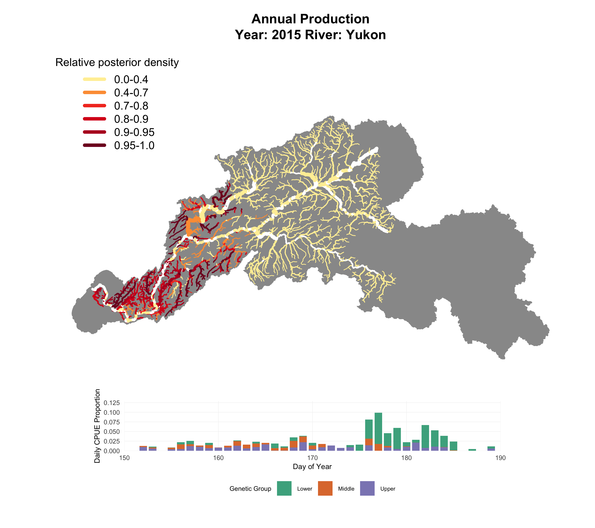
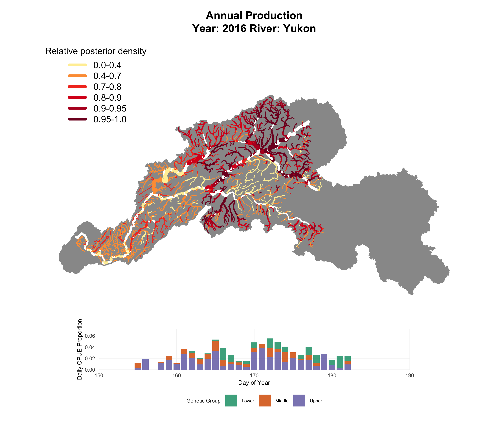
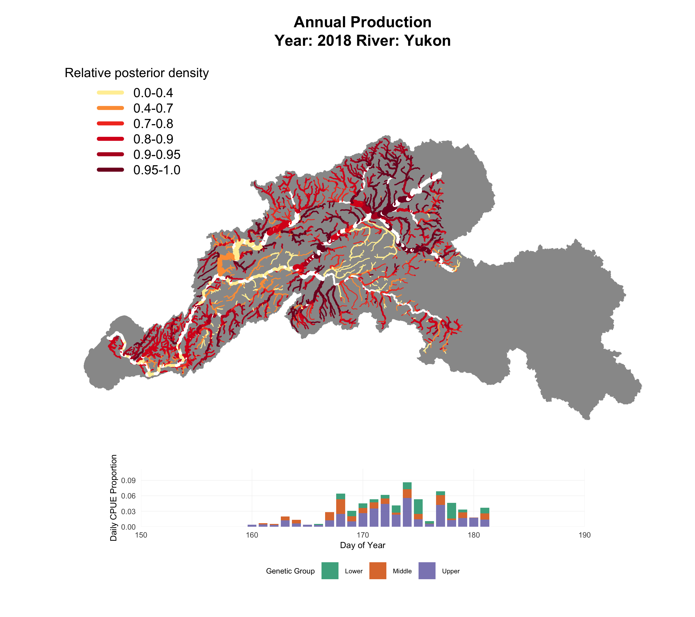
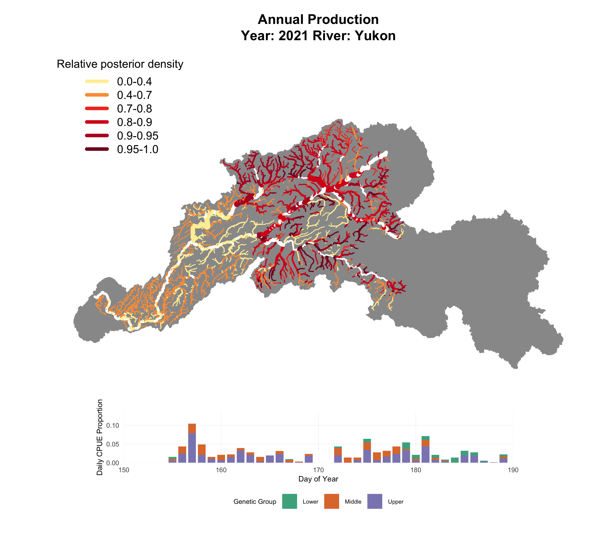
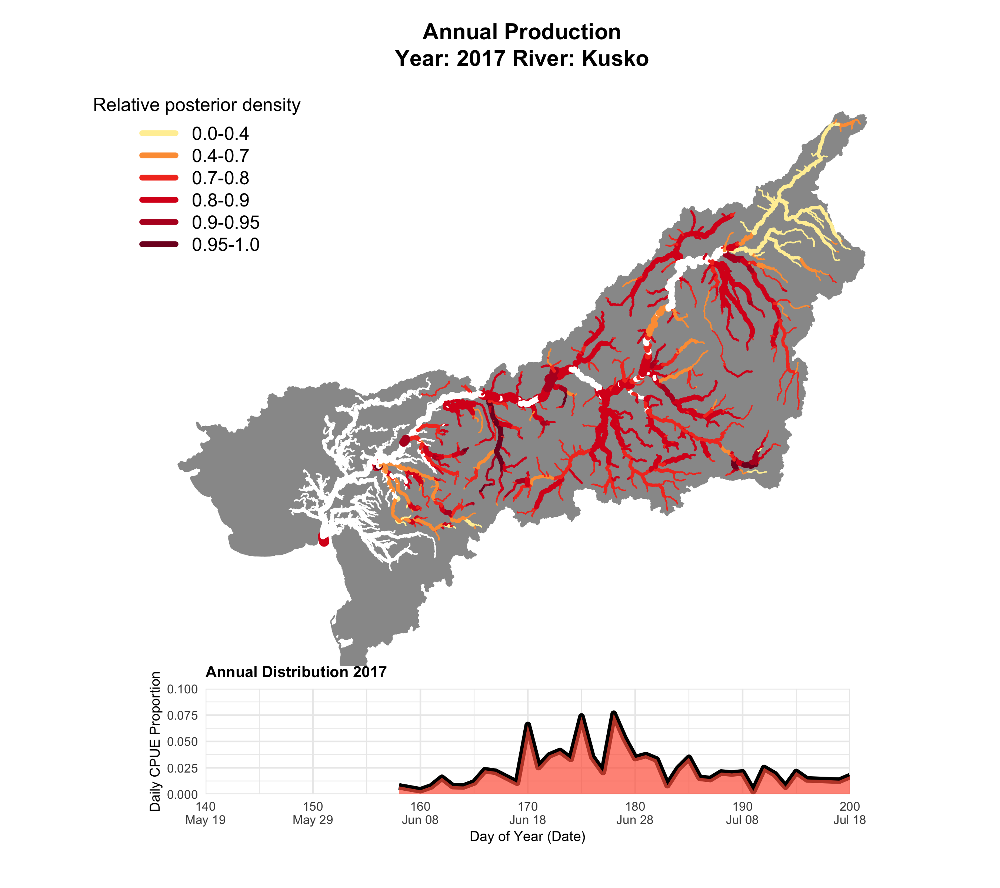
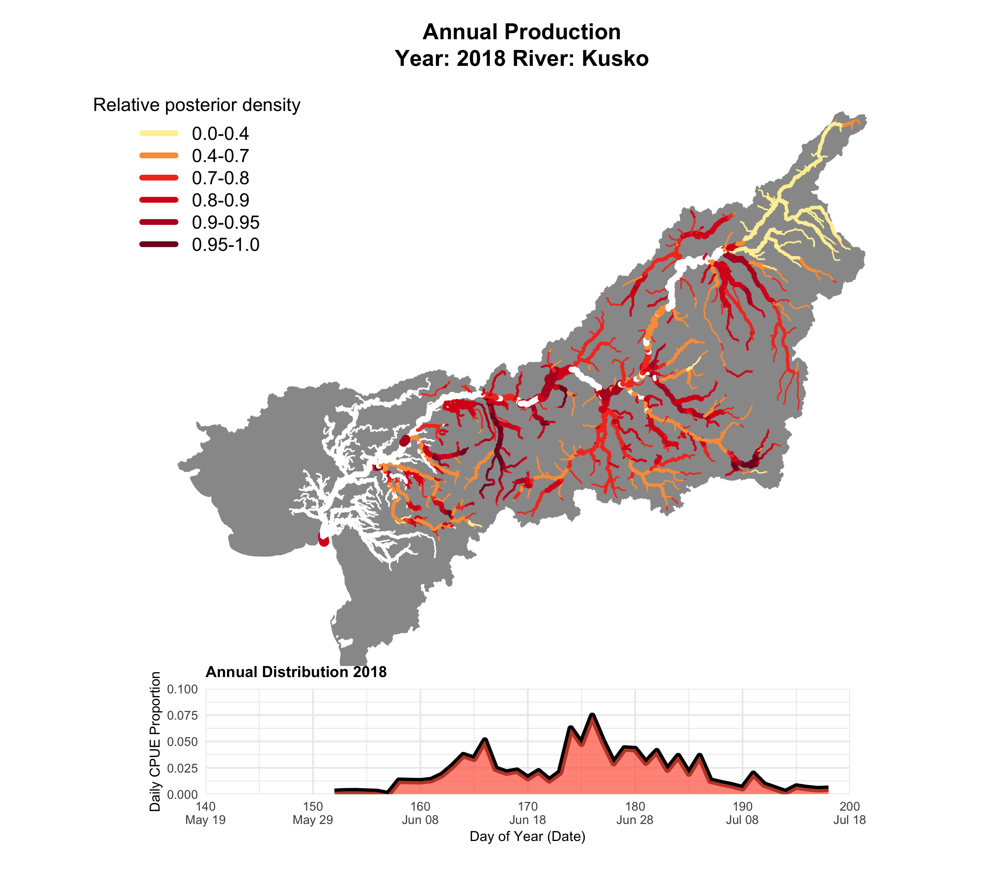
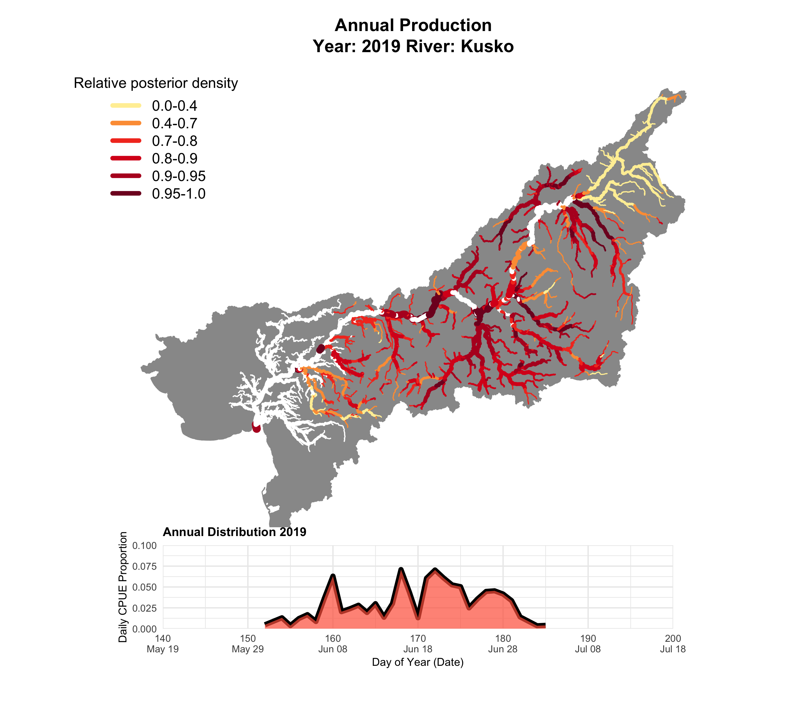
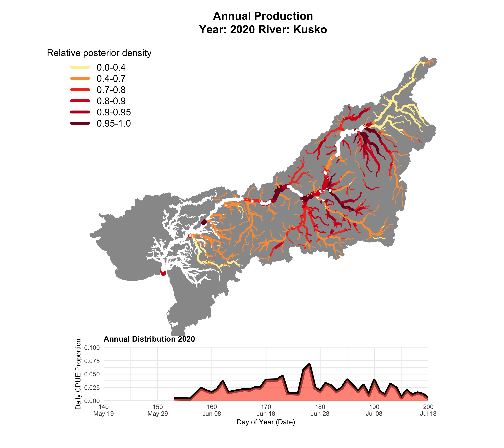
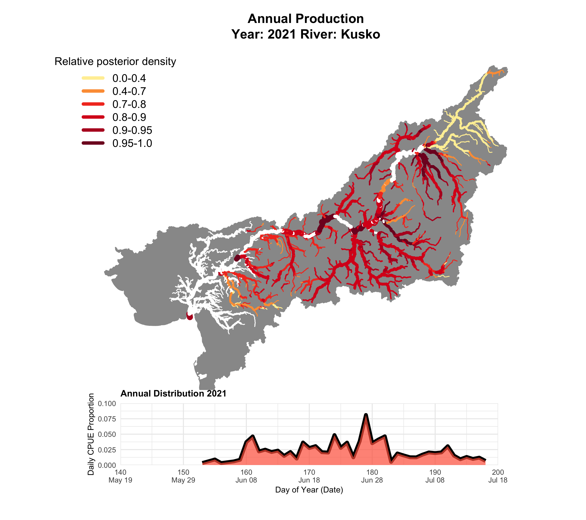

<!-- # Data Completedness -->

<!-- ::: panel-tabset -->

<!-- ### Yukon -->

```{r, echo=FALSE, out.width="100%",include = FALSE }
knitr::include_graphics("./Figures/Yukon_Data_Availability_With_Genetics.png")
```

<!-- ### Kusko -->

```{r, echo=FALSE, out.width="100%", include = FALSE}
knitr::include_graphics("./Figures/Kusko_Data_Availability_Overview.png")
```

<!-- ::: -->

## Yukon - Full Years

Minimum Stream Order: 4 Assignment Threshold: 0

::: panel-tabset
### 2015

```{r, echo=FALSE, out.width="100%"}

```

### 2016

```{r, echo=FALSE, out.width="100%"}

```

### 2018 
```{r, echo=FALSE, out.width="100%"}

```

### 2021

```{r, echo=FALSE, out.width="100%"}

```
:::

## Kuskokwim - Full Years

Minimum Stream Order: 3

::: panel-tabset
### 2017

```{r, echo=FALSE, out.width="100%"}

```

### 2018

```{r, echo=FALSE, out.width="100%"}

```

### 2019

```{r, echo=FALSE, out.width="100%"}

```

### 2020

```{r, echo=FALSE, out.width="100%"}

```

### 2021

```{r, echo=FALSE, out.width="100%"}

```
:::

# Heterogeneity across dimensions

### Age class (1.3 vs 1.4, and individuals within the top 20% of fw growth)

::: panel-tabset
### 2015

```{r, echo=FALSE, out.width="100%"}
knitr::include_graphics("./Figures/Yukon_FourPanel_2015.png")
```

### 2016

```{r, echo=FALSE, out.width="100%"}
knitr::include_graphics("./Figures/Yukon_FourPanel_2016.png")

```
:::

::: panel-tabset
{r, echo=FALSE, out.width="100%"}

knitr::include_graphics("./Figures/Yukon_FourPanel_2016.png")

### 2021

```{r, echo=FALSE, out.width="100%"}
knitr::include_graphics("./Figures/Yukon_FourPanel_2021.png")
```
:::

# 
