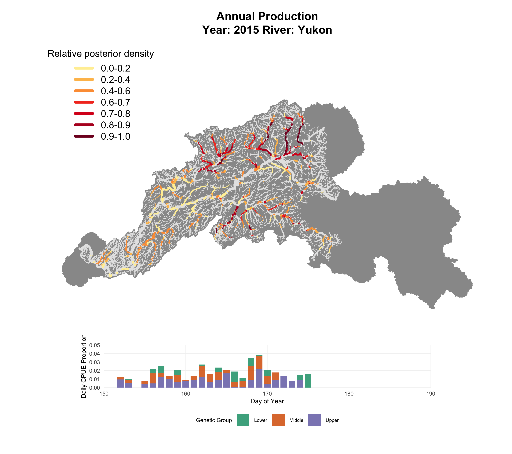
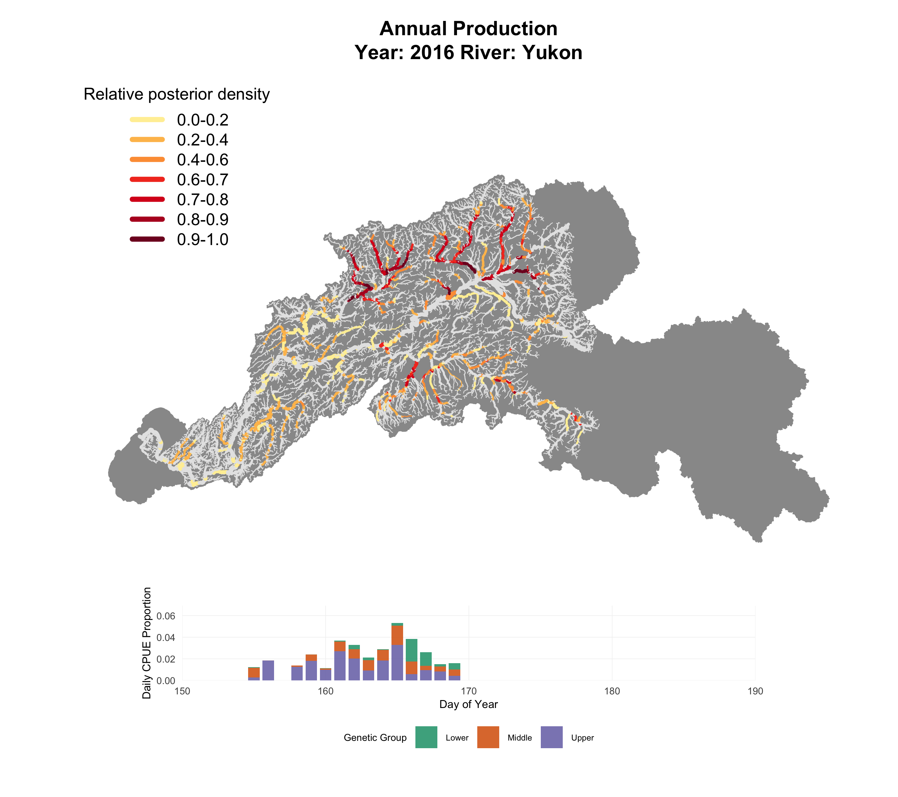
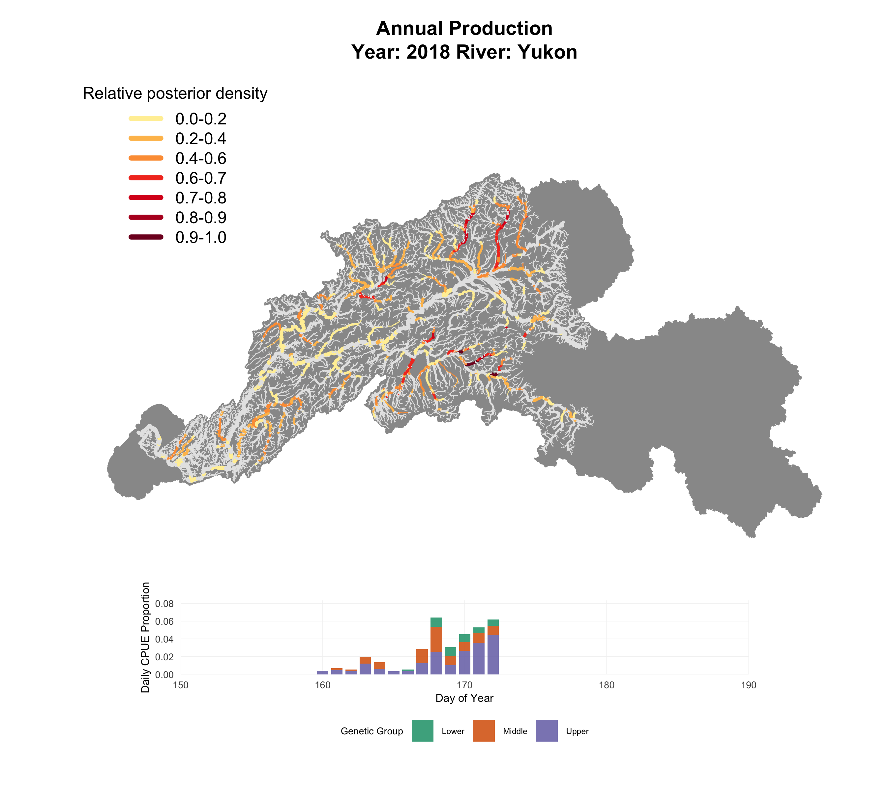
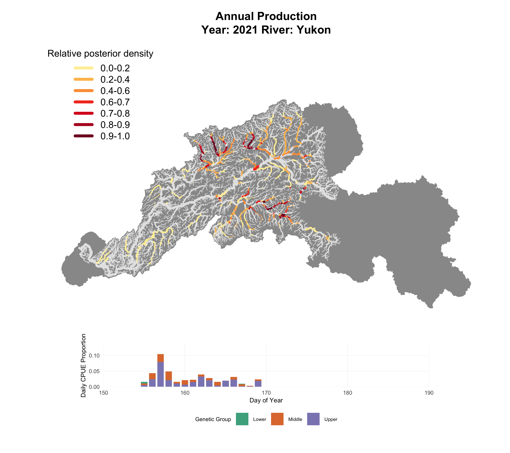

## Yukon - Full Years

::: panel-tabset
### 2015

```{r, echo=FALSE, out.width="100%"}
knitr::include_graphics("./Maps/Yukon_Annual/Production/Full_Year/2015_Yukon_Annual_Production.png")
```

### 2016

```{r, echo=FALSE, out.width="100%"}
knitr::include_graphics("./Maps/Yukon_Annual/Production/Full_Year/2016_Yukon_Annual_Production.png")
```

### 2021

```{r, echo=FALSE, out.width="100%"}
knitr::include_graphics("./Maps/Yukon_Annual/Production/Full_Year/2021_Yukon_Annual_Production.png")
```
:::

## Yukon - Half Years (50% CPUE Cutoff)

::: panel-tabset
### 2015

```{r, echo=FALSE, out.width="100%"}

```

### 2016

```{r, echo=FALSE, out.width="100%"}

```

### 2018

```{r, echo=FALSE, out.width="100%"}

```

### 2021

```{r, echo=FALSE, out.width="100%"}

```
:::

## Kuskokwim - Full Years

::: panel-tabset
### 2017

```{r, echo=FALSE, out.width="100%"}
knitr::include_graphics("./Maps/Kusko_Annual/Production/Full_Year/2017_Kusko_Annual_Production.png")
```

### 2018

```{r, echo=FALSE, out.width="100%"}
knitr::include_graphics("./Maps/Kusko_Annual/Production/Full_Year/2018_Kusko_Annual_Production.png")
```

### 2019

```{r, echo=FALSE, out.width="100%"}
knitr::include_graphics("./Maps/Kusko_Annual/Production/Full_Year/2019_Kusko_Annual_Production.png")
```

### 2020

```{r, echo=FALSE, out.width="100%"}
knitr::include_graphics("./Maps/Kusko_Annual/Production/Full_Year/2020_Kusko_Annual_Production.png")
```

### 2021

```{r, echo=FALSE, out.width="100%"}
knitr::include_graphics("./Maps/Kusko_Annual/Production/Full_Year/2021_Kusko_Annual_Production.png")
```
:::
